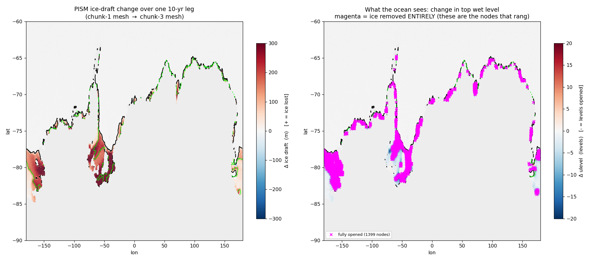
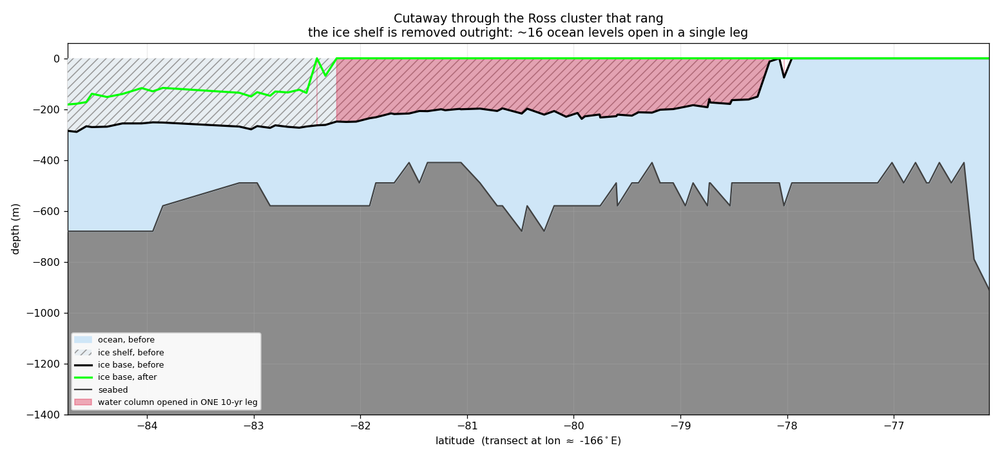

# AWI-ESM3 ↔ PISM moving-cavity crash investigation

Investigation log, plots, and scripts for two coastal-margin blockers hit on the first
mesh-change leg of an end-to-end **AWI-ESM3 (FESOM2 + OIFS-48r1 + LPJ-GUESS) ↔ Antarctic-PISM
moving-cavity** coupled run (driven by `esm_tools`). On each mesh-change leg the coupling
machinery regenerates the FESOM sub-mesh, the OASIS grids/masks/weights, and the OIFS `ICMGG`
so all components agree on the new coastline.

## The two blockers

- **Blocker I — OIFS step-0 coastline crash — RESOLVED.** A floating-point NaN struck exactly
  the coastline cells whose land–sea type flipped: `ocp-tool` half-converted a flipped cell
  (only mask + soil type), OIFS re-ingested the inconsistency from the regenerated `ICMGG` and
  NaN'd in moist physics. Fixed by a masked NN rebuild of each flipped cell + `ICMGG` re-ingest.
  (A recurring `voskin` floating-overflow variant still shows up state-dependently — see the
  report / `DATA.md`.)

- **Blocker II — FESOM cavity-margin blowup — ROOT CAUSE REVISED 2026-07-13.**
  ~4–10 model days in, FESOM blows up at the cavity margin. **Read
  `report/dynamics_seam_2026-07-13.tex` — it supersedes the earlier root-cause claim.**

  The earlier claim on this page ("a geostrophically-unbalanced remapped state; fix = thermal-wind
  velocity init") is **FALSIFIED**. That fix was implemented and failed its own offline gate
  (discrete ∇p at grid-scale fronts is noisier than the NN fill); it ships opt-in only
  (`REMAP_GEOSTROPHIC=1`), off by default.

  **What we now know, each from a direct control:**
  - **The geometry is fine.** A **cold start on the very same PISM cavity, at the full 1200 s
    timestep, is stable** (13+ days, worst CFLz 3.44 — vs 2.61 on the full-mesh control). The same
    mesh warm-started from our remapped restart dies on day 4.
  - **Ruled out:** coupling/OIFS (ocean-only reproduces it), CORE2 forcing shock (full-mesh control
    stable 21 d), remap corruption (unchanged 204,970 nodes are **bit-exact**), the restart *fill
    values* (5 independent strategies, all die), thin/pathological columns (submesh is *cleaner*
    than the mother), **basal melt** (melt-OFF still dies), and **timestep** (60 s kills CFLz but
    dies of η; 120 s dies day 8.9).
  - **The killer is the remapped *dynamics seam*:** we reproduce the evolved restart bit-exactly on
    the untouched 98.2% of nodes, then splice *patched* values at the 3840 changed nodes. The
    runaway grows in the ring around the patch (every escalation site <0.22° from a changed node).
    Zeroing the dynamics globally removes the crash — which is why all five fill strategies failed:
    each varied the *patch* while leaving the *seam*.
  - **A real bug found (but not the cure):** FESOM keeps η≡0 under ice, yet the remap gave the 987
    nodes newly *under* ice their old open-ocean ssh (≈ −1.6 m). Fixed; the run still dies.

  **We were testing the wrong change.** The CORE3(observed)→PISM swap is a one-off monster
  (max |Δdraft| = **2711 m**; 1579 nodes flip to sub-ice) that production *never has to survive*.
  What production must survive is a **10-yr PISM increment (mean |Δdraft| ≈ 22 m)** — and that has
  **never been tested**.

  **Current strategy:** cold-start the ocean on PISM's cavity (never remap across the swap), then
  test the remap on a genuine 10-yr increment carrying a year of real spun-up dynamics. That is the
  experiment that decides whether the coupling is viable (experiment `movcav12`).

## THE CURRENT PICTURE (2026-07-13, evening) — read `report/increment_test_2026-07-13`

The cold-start strategy worked: chunk-1 ran a clean model year on PISM's cavity, PISM ran its
10 years, and for the first time the remap was asked to carry **a year of spun-up ocean dynamics
across a real PISM increment**. It crashed on day 15.7 — but the *way* it crashed inverts the
conclusion.

**PISM is collapsing, and our ocean reacts violently to it.**

| | monster swap (CORE3→PISM) | real increment (this leg) |
|---|---|---|
| CFLz over time | 4.46 → 6.43 → 7.25 → **9.24** (runaway) | 5.26 → **5.78** → 5.40 → 4.51 → **4.15** (**peaks, then DECAYS**) |
| η NaN | yes | **none** — all 209,172 nodes finite |
| \|η\|>3 nodes | 3611, basin-wide, radiating | **17**, one tight cluster, all on changed nodes |

All 17 ringing nodes share one signature: **`ulev 17 → 1`** — 16 ocean levels opening *at once*,
i.e. the ice shelf above them removed **entirely** in a single leg. Their η alternates in sign
(+24, −18, +16) — a grid-scale checkerboard, not a basin mode.

**Why the tail is so extreme: PISM is in massive disequilibrium.**




The cutaway says it plainly: the Ross ice-shelf front retreats **~4° of latitude (~440 km) in ONE
10-yr leg**. The plan view shows it is not a Ross anomaly — the **1399 nodes where the ice is
removed outright** (magenta) ring the *entire* Antarctic margin.

| | |
|---|---|
| changed nodes this leg | 3248 (1.55% of mesh) |
| \|Δulev\| ≥ 10 | 1582 |
| **ice removed ENTIRELY** | **1399** |
| mean \|Δdraft\| | **2.9 m** ← *meaningless* |
| max \|Δdraft\| | **923 m** |
| PISM floating cells | 24,815 → 20,093 (**−24% in 10 yr**) |

**The mean is a lie** — diluted by the vast unchanged interior. The earlier claim that a 10-yr PISM
increment is a gentle ~22 m change, which motivated the whole "sidestep the swap and the increments
will be fine" strategy, was **wrong**.

**Read the 99% soberly.** Of the 1399 fully-opened nodes only 17 rang, and CFLz peaked then
decayed — so the remap machinery is doing better than a "crashed at day 15" headline suggests.
**But the run still crashed.** What this tells us is that **our ocean reacts violently to ice-shelf
and cavity changes mid-run**: a handful of columns where the ice vanishes outright is enough to kill
a leg. Absorbing 99% of the change is not a passing grade when the remaining 1% is fatal. **This is
not good news.**

**Where to go from here** — two branches of work, plus the thing that would actually fix it:

1. **Find out why PISM is collapsing, and stop it.** A run shedding 24% of its floating area in a
   decade is the anomaly and everything downstream inherits it. **First thing to check is the
   sub-shelf melt *we* feed PISM** — if our ocean hands it unrealistic melt, PISM's collapse is our
   own doing.
2. **Try to stabilise the ocean locally**: reduce the ocean timestep and/or raise viscosity *in the
   neighbourhood of the changed columns*. A mitigation, not a cure — but it may keep the coupling
   running while (1) is sorted. Note the *global* knobs are exhausted: a global timestep cut does not
   help (60 s merely swaps the CFLz symptom for an η one).
3. **The lasting way forward: compute physically consistent fields for the newly opened cavity.**
   Patching such a column with plausible *values* is exactly what does not work (five fill
   strategies, all dead). What is needed is a state for the newly opened water that is *dynamically
   consistent with its surroundings*, not merely a sensible number in each cell. That is the real
   problem, and the one worth solving.

Also fixed on the way (esm_tools `eef4f6db`): the remap **manufactured** a −45 °C value via an
**unbounded linear extrapolation** below the old seabed (a value present nowhere in the source).
Never hit before because the mesh had never *grown* — ice retreat exercises that path for the first
time.

## Coupling plumbing (2026-07-13) — latent bugs exposed by a submesh chunk-1

Making chunk-1 run on the **PISM-cavity submesh** (cold start) instead of the full mesh pushed a
*submesh* leg through `couple_out` for the first time. Every previous run either ran chunk-1 on the
**full mesh** (where these paths are trivially correct) or died early in chunk-3 (before ever
reaching the end of a leg). That immediately exposed several latent bugs — none of them physics:

| bug | cause | note |
|---|---|---|
| OASIS abort at ~day 300 | `A_Q_ice -> heat_ico` used `GSSPOS` conservation. Its correction is built from the summed source/target ratio; when the summed *target* residual is ~0 while the source residual is small-but-nonzero, it explodes (`gsspos sumdst is zero but sumsrc is not`, `mod_oasis_advance.F90`) | fixed: new `gauswgt_gsmart` transform (GSMART), `heat_ico` switched. Pre-existing. `FCO2_oce` + `awicm3.yaml` still on `gsspos` |
| namcouple feom dim never patched | `fix_namcouple_feom_dim` read `${MAXMESH_DIR_fesom}`, which is assigned **inside `build_submesh`** — a *different* subjob/shell. So it was always unset, `full=''`, and the guard refused to patch. **On every leg, always.** | fixed: use `MAX_MESH` (what `env_fesom.py` actually exports). Invisible until a submesh leg reached the end-of-leg restart write (`av gsize nx ny mismatch`) |
| `fesom2ice` broadcast error | passed `--FESOM_MESH ${MESH_DIR_fesom}` (static full mesh) while FESOM's output is on the submesh: `could not broadcast input array from shape (208810,) into shape (12,211567)` | fixed: take the mesh from the run's own `namelist.config` `MeshPath` |
| `couple_namcouple` skipped on chunk 1 | correct when chunk-1 was a *full-mesh* leg; wrong once chunk-1 became a submesh leg | fixed (self-inflicted, 2026-07-13) |

**Chunk-1 now completes a full year on the submesh** (worst CFLz ~3.75, production 1200 s timestep),
hands off to PISM, and the workflow proceeds. **Chunk-3 — the remap of a real 10-yr PISM increment
carrying a year of spun-up dynamics — remains the open, decisive test.**

## Chunk-1 artifacts are pooled

`couple_in`'s chunk-1 outputs are deterministic (they derive from PISM's *initial* geometry), so they
are pre-staged at `/work/ab0246/a270092/input/fesom2/pism_cavity_ini/` (540 MB; submesh + `dist_1792`,
OASIS grids/masks/areas/rmp, ICMGG, plit, remapped `rstas`/`rstos`). With
`couple_in: skip_chunk_number: 1`, chunk-1 needs **no** `couple_dir` paths, so `esm_runscripts` can be
run straight from the **login node** — it just submits the compute job (no ~7 min regen, no sbatch
wrapper). `couple_namcouple` must still run. Chunk >=3 regenerates per PISM increment as before.

## Known cost: the post-model tail

After the model finishes, the leg spends **~9.5 min still holding all 45 nodes**: `tidy` moves
**53 GB** of output (42 GB OIFS 6-hourly pressure-level fields + 11 GB FESOM), then `fesom2ice`
(~87 s of real work) and `esm2pism` run. Two levers:
- the runscript had **`parallel_file_movements: false`** (a login-node workaround) overriding the
  awiesm3 default `'threads'` — so 53 GB was being copied **sequentially**. Removed.
- the 42 GB of 6-hourly `u/v/w/q/t/z/vo` on pressure levels is not needed by PISM (it consumes only
  the `*_for_ice` fields) and could be trimmed for coupling test runs.

## Repository layout

```
report/
  dynamics_seam_2026-07-13.{tex,pdf}  — CURRENT root cause; supersedes the plan below (read first)
  balanced_restart_plan.{tex,pdf}     — SUPERSEDED design note (thermal-wind init; hypothesis falsified)
  movcav_lsm_investigation.{tex,pdf}  — the original investigation log (Blocker I, evolution view)
figures/
  initstate/       step-1 (t=0 remapped state) plots — the root-cause evidence (movcav8 v4)
  evolution/       hourly-movie key frames + earlier crash-analysis overviews (movcav4)
  movies/          blowup_TSw_evolution.mp4, blowup_section_evolution.mp4 (movcav4)
scripts/
  plotting/        the initstate PolyCollection plotters + the dateline-artifact diagnostics
  crash_analysis/  the standalone FESOM2 blowup-file analysis suite (run_analysis.py + plots)
  remap_and_coupling/  the actual fix code: F90 restart remap, pyfesom2 griddes, couple glue
  flux_decomp.py   OASIS heat-flux decomposition (solar vs non-solar)
DATA.md            experiments, data paths, key files, jobs, analysis env — start here to reproduce
```

## Key figures
- `figures/initstate/planview_seed_weddell.png` + `section_lat_seed_weddell.png` — the
  **initiation seed**: fresh cavity column (S≈31) at the ice front, **zero velocity**, `w` dipole.
- `figures/initstate/planview_A_90E_L38.png`, `planview_D_60s_etacrash.png` — two other
  high-CFLz sites, both **benign at t=0** (peak-CFLz is a *consequence*, not the seed).
- `figures/initstate/diag_artifact.png` — proof the "horizontal stripes" in early plots were
  **dateline-wrapping triangles** (a plotting artifact), not data.
- `figures/movies/*.mp4` — the blowup growing over days (the evolution view, reconciled in the
  report with the step-1 view).

## Build the report
```
cd report && pdflatex movcav_lsm_investigation.tex    # figure paths are relative to report/? no — see note
```
Note: the `.tex` uses `\includegraphics{movcav4_crash_plots/...}` paths from the original
working tree; the packaged `.pdf` is the built version. To rebuild against this repo, point the
graphics path at `../figures` (the `initstate/`, `evolution/` subdirs match) or keep the shipped PDF.

Analysis Python (unstructured FESOM plotting): `/home/a/a270092/.conda/envs/pyfesom2_env/bin/python`.
