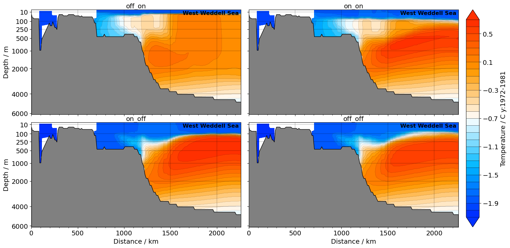

# AWI-ESM3 ↔ PISM moving-cavity crash investigation

Investigation log, plots, and scripts for two coastal-margin blockers hit on the first
mesh-change leg of an end-to-end **AWI-ESM3 (FESOM2 + OIFS-48r1 + LPJ-GUESS) ↔ Antarctic-PISM
moving-cavity** coupled run (driven by `esm_tools`). On each mesh-change leg the coupling
machinery regenerates the FESOM sub-mesh, the OASIS grids/masks/weights, and the OIFS `ICMGG`
so all components agree on the new coastline.

## The two blockers

- **Blocker I — OIFS step-0 coastline crash — RESOLVED.** A floating-point NaN struck exactly
  the coastline cells whose land–sea type flipped: `ocp-tool` half-converted a flipped cell
  (only mask + soil type), OIFS re-ingested the inconsistency from the regenerated `ICMGG` and
  NaN'd in moist physics. Fixed by a masked NN rebuild of each flipped cell + `ICMGG` re-ingest.
  (A recurring `voskin` floating-overflow variant still shows up state-dependently — see the
  report / `DATA.md`.)

- **Blocker II — FESOM cavity-margin blowup — ROOT CAUSE REVISED 2026-07-13.**
  ~4–10 model days in, FESOM blows up at the cavity margin. **Read
  `report/moving_cavity_investigation.tex` — it supersedes the earlier root-cause claim.**

  The earlier claim on this page ("a geostrophically-unbalanced remapped state; fix = thermal-wind
  velocity init") is **FALSIFIED**. That fix was implemented and failed its own offline gate
  (discrete ∇p at grid-scale fronts is noisier than the NN fill); it ships opt-in only
  (`REMAP_GEOSTROPHIC=1`), off by default.

  **What we now know, each from a direct control:**
  - **The geometry is fine.** A **cold start on the very same PISM cavity, at the full 1200 s
    timestep, is stable** (13+ days, worst CFLz 3.44 — vs 2.61 on the full-mesh control). The same
    mesh warm-started from our remapped restart dies on day 4.
  - **Ruled out:** coupling/OIFS (ocean-only reproduces it), CORE2 forcing shock (full-mesh control
    stable 21 d), remap corruption (unchanged 204,970 nodes are **bit-exact**), the restart *fill
    values* (5 independent strategies, all die), thin/pathological columns (submesh is *cleaner*
    than the mother), **basal melt** (melt-OFF still dies), and **timestep** (60 s kills CFLz but
    dies of η; 120 s dies day 8.9).
  - **The killer is the remapped *dynamics seam*:** we reproduce the evolved restart bit-exactly on
    the untouched 98.2% of nodes, then splice *patched* values at the 3840 changed nodes. The
    runaway grows in the ring around the patch (every escalation site <0.22° from a changed node).
    Zeroing the dynamics globally removes the crash — which is why all five fill strategies failed:
    each varied the *patch* while leaving the *seam*.
  - **A real bug found (but not the cure):** FESOM keeps η≡0 under ice, yet the remap gave the 987
    nodes newly *under* ice their old open-ocean ssh (≈ −1.6 m). Fixed; the run still dies.

  **We were testing the wrong change.** The CORE3(observed)→PISM swap is a one-off monster
  (max |Δdraft| = **2711 m**; 1579 nodes flip to sub-ice) that production *never has to survive*.
  What production must survive is a **10-yr PISM increment (mean |Δdraft| ≈ 22 m)** — and that has
  **never been tested**.

  **Current strategy:** cold-start the ocean on PISM's cavity (never remap across the swap), then
  test the remap on a genuine 10-yr increment carrying a year of real spun-up dynamics. That is the
  experiment that decides whether the coupling is viable (experiment `movcav12`).

## ROOT CAUSE FOUND (2026-07-14): the salt plume parameterisation was OFF

**`spp = .false.`** — that's it.

`spp` distributes the **brine rejected when sea ice grows** *downward* through the water column
(`SPP_dep_S = -80 m`) instead of leaving it in the surface layer. **That is how High Salinity Shelf
Water forms.** Without it, the brine is mixed away at the surface, no dense shelf water forms,
nothing excludes the warm deep water — and it floods the Antarctic shelf and then the cavities.

**The chain:**

| | |
|---|---|
| `spp = .false.` | no brine plume |
| → no HSSW | nothing excludes warm deep water |
| → cavity **+1.2 K** above freezing (should be ~0.2 K) | |
| → FESOM melts shelves at **~28 m/yr** (observed ~0.8 m/yr) | |
| → PISM sheds **24% of floating area per decade** | 1399 nodes lose their ice *entirely* per leg; Ross front −440 km |
| → the ocean is asked to swallow that every leg | and fails |

**"PISM is collapsing" and "the ocean can't absorb the increment" are the same problem, and we
caused both.**

**The initial condition is irrelevant — the model heats the cavity itself.** We prepared a chunk-1
restart with a properly cold cavity (driving **+0.06 K**). After *one model year* it had warmed to
**+1.25 K**, and the cold-started run converged to the same **+1.21 K**. Melt identical (28.28 vs
28.29 m/yr).

**Xiaojie had already shown this in standalone CORE3** — West Weddell transect, 1972–1981
(`/home/a/a270234/my_work/20260407/temp_fesom_core3_WWS.ipynb`):



Top row (**spp ON**): shelf cold to the bottom, warm deep water pushed offshore and down.
Bottom row (**spp OFF — our config**): warm water sits right against the shelf break.

**Fix:** `spp: ".true."` in `namelist.oce` `&oce_dyn`. (`use_momix` is already on by FESOM default.)

**Also wrong, independently:** the PISM ocean forcing averages FESOM levels **1–20 = 0–410 m,
starting at the surface** (`-sellevidx,1/20`) and hands that to PISM's `-ocean th`, a *local
boundary-layer* scheme that needs the water *in contact with the ice base*. The correct code
(`-sellevel,150/600`) is right there, disabled behind `if [ 0 -eq 1 ]`. This did **not** cause the
collapse (FESOM's own melt was equally catastrophic) but it is wrong and should go.

## Repository layout

```
report/
  moving_cavity_investigation.{tex,pdf}  — THE report. Single living document; superseded
                                          claims are struck through, not deleted.
figures/
  initstate/       step-1 (t=0 remapped state) plots — the root-cause evidence (movcav8 v4)
  evolution/       hourly-movie key frames + earlier crash-analysis overviews (movcav4)
  movies/          blowup_TSw_evolution.mp4, blowup_section_evolution.mp4 (movcav4)
scripts/
  plotting/        the initstate PolyCollection plotters + the dateline-artifact diagnostics
  crash_analysis/  the standalone FESOM2 blowup-file analysis suite (run_analysis.py + plots)
  remap_and_coupling/  the actual fix code: F90 restart remap, pyfesom2 griddes, couple glue
  flux_decomp.py   OASIS heat-flux decomposition (solar vs non-solar)
DATA.md            experiments, data paths, key files, jobs, analysis env — start here to reproduce
```

## Key figures
- `figures/initstate/planview_seed_weddell.png` + `section_lat_seed_weddell.png` — the
  **initiation seed**: fresh cavity column (S≈31) at the ice front, **zero velocity**, `w` dipole.
- `figures/initstate/planview_A_90E_L38.png`, `planview_D_60s_etacrash.png` — two other
  high-CFLz sites, both **benign at t=0** (peak-CFLz is a *consequence*, not the seed).
- `figures/initstate/diag_artifact.png` — proof the "horizontal stripes" in early plots were
  **dateline-wrapping triangles** (a plotting artifact), not data.
- `figures/movies/*.mp4` — the blowup growing over days (the evolution view, reconciled in the
  report with the step-1 view).

## Build the report
```
cd report && pdflatex moving_cavity_investigation.tex    # figure paths are relative to report/? no — see note
```
Note: the `.tex` uses `\includegraphics{movcav4_crash_plots/...}` paths from the original
working tree; the packaged `.pdf` is the built version. To rebuild against this repo, point the
graphics path at `../figures` (the `initstate/`, `evolution/` subdirs match) or keep the shipped PDF.

Analysis Python (unstructured FESOM plotting): `/home/a/a270092/.conda/envs/pyfesom2_env/bin/python`.
